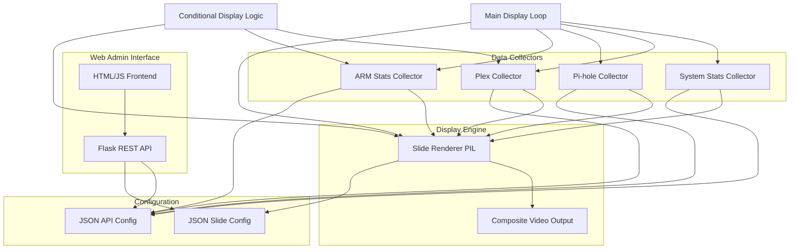

# Raspberry Pi CRT Stats Display Application

## Architecture Overview

The application consists of a multi-threaded Python service with:

- **Display Engine**: Renders slides to composite video output (320x280, monochrome, Fallout aesthetic)
- **Data Collectors**: Background services fetching stats from ARM, Pi-hole, and Plex APIs
- **Web API**: Flask backend for slide management and configuration
- **Web UI**: Admin interface for creating/reordering slides
- **Main Loop**: Cycles through configured slides with conditional display logic
- **Conditional Display**: ARM and Plex slides only appear when active (rip in progress / streaming active)



## Project Structure

```
homelab-hud/
├── app.py                      # Main application entry point
├── config.py                   # Configuration management
├── requirements.txt            # Python dependencies
├── README.md                   # Setup and usage instructions
├── backend/
│   ├── __init__.py
│   ├── api/
│   │   ├── __init__.py
│   │   ├── routes.py           # Flask API routes
│   │   └── models.py           # Data models for slides/config
│   ├── collectors/
│   │   ├── __init__.py
│   │   ├── base.py             # Base collector class
│   │   ├── arm_collector.py    # ARM stats collector
│   │   ├── pihole_collector.py # Pi-hole stats collector
│   │   └── plex_collector.py   # Plex now playing collector
│   ├── display/
│   │   ├── __init__.py
│   │   ├── renderer.py         # Slide rendering with PIL
│   │   ├── video_output.py     # Composite video output handler
│   │   └── themes.py           # Fallout-style theme/fonts
│   └── utils/
│       ├── __init__.py
│       └── helpers.py          # Utility functions
├── frontend/
│   ├── static/
│   │   ├── css/
│   │   │   └── style.css       # Admin UI styling
│   │   └── js/
│   │       └── app.js          # Slide editor JavaScript
│   └── templates/
│       └── index.html          # Admin UI HTML
└── data/
    ├── slides.json             # Slide configuration (auto-generated)
    ├── api_config.json         # API endpoints/credentials (auto-generated)
    └── fonts/                  # Fallout-style fonts (monospace)
```

## Key Components

### 1. Display Engine (`backend/display/`)

**Renderer (`renderer.py`)**:

- Uses PIL/Pillow to create 320x280 monochrome images
- Implements Fallout aesthetic: high contrast, monospace terminal fonts, minimal graphics
- Supports slide types:
  - Text stats (single values, lists)
  - Progress bars (for completion percentages, storage usage)
  - Simple charts (bar charts for top items)
  - Now playing info (Plex - conditional)
  - ARM rip progress (conditional)
  - System stats (CPU, Memory, NAS storage)

**Video Output (`video_output.py`)**:

- Platform-aware output abstraction:
  - **Production (Raspberry Pi)**: Outputs to framebuffer (`/dev/fb0`) or pygame SDL composite output
  - **Development (Mac)**: File-based preview (PNG sequence) or pygame window display
- Environment detection: `sys.platform == 'darwin'` for Mac, `'linux'` for Pi
- Configures composite video output on Pi (via system config if needed)
- Handles display refresh and frame updates
- Dev mode: Saves frames to `data/preview/` or displays in pygame window

**Theme (`themes.py`)**:

- Defines color palette (black/white/grayscale for CRT)
- Monospace font loading and sizing
- Layout templates for different slide types

### 2. Data Collectors (`backend/collectors/`)

**Base Collector (`base.py`)**:

- Abstract base class with common polling/error handling
- Caching and rate limiting

**ARM Collector (`arm_collector.py`)**:

- Polls ARM API endpoint: `{api_url}/json?mode=joblist`
- Parses JSON response structure:
  - `success`: Boolean indicating API call success
  - `results`: Object with job IDs as keys (e.g., "0", "1")
  - Each job contains: `status`, `title`, `disctype`, `video_type`, `start_time`, `stage`, `pid`, `no_of_titles`, `year`, etc.
- **Conditional Display Logic**: 
  - Scans `results` object for jobs with `status: "active"`
  - `has_active_rip()` returns `True` if any job has `status == "active"`
  - Returns structured stats only when active rip detected, otherwise returns `None`
- Active rip stats returned:
  - Job title (`title`)
  - Disc type (`disctype` or `video_type`)
  - Start time (`start_time`)
  - Number of titles (`no_of_titles`)
  - Year (`year` if available)
  - Process ID (`pid`)
  - Stage indicator (`stage` - appears to be timestamp-based, can calculate elapsed time)
- Error handling: Handles API failures, network errors, invalid JSON responses

**Pi-hole Collector (`pihole_collector.py`)**:

- Uses Pi-hole Admin API (`/admin/api.php`)
- Collects: total queries, blocked queries, percentage, top clients, top domains
- Polls at configurable intervals

**Plex Collector (`plex_collector.py`)**:

- Uses Plex Media Server API (with authentication token)
- Fetches now playing sessions
- Collects: active streams, transcoding status, media info (title, progress, user)
- **Conditional Display**: Only returns data when active streams exist (checks session count)
- Returns `None` or empty state when no one is streaming (slide will be skipped)

**System Collector (`system_collector.py`)**:

- Collects local system statistics using `psutil` library
- CPU usage (percentage, per-core if desired)
- Memory usage (used/available/total, percentage)
- NAS storage stats:
  - Mount point detection (configurable paths via web UI)
  - Available/used/total space per mount
  - Percentage used
  - Supports multiple NAS mounts (SMB, NFS, local)
- Returns structured stats for rendering
- Polls at configurable intervals (default: 5 seconds)

### 3. Web API (`backend/api/`)

**Routes (`routes.py`)**:

- `GET /api/slides` - List all slides
- `POST /api/slides` - Create new slide
- `PUT /api/slides/<id>` - Update slide
- `DELETE /api/slides/<id>` - Delete slide
- `POST /api/slides/reorder` - Reorder slides (accepts array of IDs)
- `GET /api/config` - Get API configuration
- `PUT /api/config` - Update API endpoints/credentials
- `GET /api/stats` - Get current stats (for preview)
- `GET /api/preview/<slide_id>` - Generate preview image of slide
- `GET /api/preview/current` - Get current slide being displayed (dev mode)
- `GET /api/preview/render` - Render all slides to preview directory (dev mode)

**Models (`models.py`)**:

- Slide schema (id, type, data source, layout, position)
- API config schema (endpoints, credentials, polling intervals)

### 4. Web UI (`frontend/`)

**Admin Interface**:

- Drag-and-drop slide reordering
- Slide editor: select data source (ARM/Pi-hole/Plex), choose layout template
- API configuration form (endpoints, tokens, ports)
- Live preview of slides
- Save/load configuration

### 5. Main Application (`app.py`)

- Initializes Flask server (runs on separate thread or port 5000)
- Starts data collectors (background threads)
- Main display loop with conditional slide filtering:
  - Loads slide configuration from `data/slides.json`
  - For each slide:
    - Checks conditional display rules:
      - **ARM slides**: Only show if `arm_collector.has_active_rip() == True`
      - **Plex slides**: Only show if `plex_collector.has_active_streams() == True`
      - **System/Pi-hole slides**: Always show (no conditions)
    - If slide should be displayed:
      - Fetches current data from appropriate collector
      - Renders slide to image
      - Outputs to composite video
      - Waits for slide duration (configurable per slide)
    - If slide should be skipped (conditional not met), immediately moves to next slide
  - Cycles through filtered slides
- Handles graceful shutdown

## Technical Implementation Details

### Composite Video Output Options

**Option 1: Framebuffer** (Recommended for simplicity):

- Write directly to `/dev/fb0` framebuffer device
- Requires: `fbset` configuration and appropriate permissions
- Pros: Direct hardware access, efficient
- Cons: May need root/sudo permissions

**Option 2: Pygame with SDL**:

- Use pygame with SDL video backend configured for composite output
- Pros: Cross-platform, easier to test
- Cons: May require additional system configuration

**Option 3: ffmpeg pipe** (Alternative):

- Render to image sequence, pipe to ffmpeg for video output
- More complex but highly configurable

### Fallout UI Design Principles

- **Colors**: Pure black (#000) background, white (#FFF) text, gray shades for accents
- **Typography**: Monospace terminal font (Consolas, Courier, or custom pixel font)
- **Layout**: Grid-based, minimal spacing, left-aligned text
- **Graphics**: ASCII-style progress bars (`[====     ]`), simple bar charts using characters
- **Animations**: Minimal (optional fade transitions between slides)

### Dependencies

```
flask>=2.3.0
pillow>=10.0.0
requests>=2.31.0
pygame>=2.5.0  # For video output (alternative: framebuffer access)
python-dotenv>=1.0.0
psutil>=5.9.0  # For system stats (CPU, memory, disk)
```

### Raspberry Pi Configuration

The application will include instructions for:

1. Enabling composite video output in `config.txt`:
   ```
   enable_tvout=1
   ```

2. Setting framebuffer resolution (if using framebuffer method)
3. Installing required system packages

## Development and Testing on Mac

The application will support full development and testing on macOS before deployment to Raspberry Pi.

### Environment Detection

- Auto-detects platform (`sys.platform` or `platform.system()`)
- Development mode on Mac (`darwin`), production mode on Raspberry Pi (`linux`)
- Environment variable override: `HUD_ENV=dev|prod`

### Testable Components on Mac

**Fully Testable (100% Mac-compatible)**:

- Web UI (Flask admin interface) - fully functional
- Data collectors (ARM, Pi-hole, Plex) - if APIs accessible over network
- Slide renderer (PIL/Pillow) - generates images identically
- System stats collector - uses `psutil` (works on Mac)
- Conditional display logic - all logic testable
- Configuration management - JSON files work everywhere

**Mockable Components (requires abstraction)**:

- Video output - use file-based or window-based preview instead of framebuffer

### Video Output Abstraction Strategy

**Implementation (`backend/display/video_output.py`)**:

- Abstract base class or platform detection for output method
- **Mac Development Mode**:
  - Option 1: Save rendered frames to `data/preview/` directory (PNG sequence)
  - Option 2: Use pygame window display (320x280 scaled window)
  - Option 3: Generate HTML preview page with auto-refresh
  - Option 4: Use SDL window via pygame (cross-platform testing)
- **Raspberry Pi Production Mode**:
  - Framebuffer output (`/dev/fb0`)
  - Or pygame SDL configured for composite output
- Detection logic:
  ```python
  if sys.platform == 'darwin' or os.getenv('HUD_ENV') == 'dev':
      output = FilePreviewOutput()  # or WindowPreviewOutput()
  else:
      output = FramebufferOutput()  # or CompositeOutput()
  ```


### Development Workflow

**1. Local Web UI Testing**:

- Run Flask server: `python app.py --dev-mode`
- Access admin UI at `http://localhost:5000`
- Test slide creation, reordering, API configuration
- Preview slides via `/api/preview/<slide_id>` endpoint (returns PNG)

**2. Data Collector Testing**:

- Configure API endpoints to point to actual services (if accessible from Mac)
- Or use mock data mode: Set `MOCK_DATA=true` environment variable
- Mock mode loads sample JSON responses from `tests/fixtures/`
- Test conditional logic with mocked active/inactive states

**3. Slide Rendering Testing**:

- Renderer works identically on Mac and Pi
- Save preview images: `python -m backend.display.renderer --save-preview`
- Generates `data/preview/*.png` files for visual inspection
- All Fallout theme rendering testable

**4. System Stats Testing**:

- `psutil` works natively on Mac
- Test CPU, memory stats (Mac values, but logic identical)
- NAS mounts: Use local Mac directories or test mount paths

**5. End-to-End Testing (Mac Preview Mode)**:

- Run main loop in preview mode: `python app.py --dev-mode --preview`
- Cycles through slides, saves frames to `data/preview/`
- Or opens pygame window showing live slide rotation
- Test conditional display: Mock active/inactive states

### Mock Data Strategy

**File Structure**:

```
tests/
├── fixtures/
│   ├── arm_active_response.json    # ARM with active rip
│   ├── arm_inactive_response.json  # ARM with no active rip
│   ├── plex_active_response.json   # Plex with active streams
│   ├── plex_inactive_response.json # Plex with no streams
│   └── pihole_response.json        # Pi-hole stats
└── mock_collectors.py              # Mock collector implementations
```

**Usage**:

- Set environment variable: `HUD_USE_MOCKS=true`
- Collectors load from fixture files instead of real APIs
- Allows testing conditional display without actual services
- Toggle active/inactive states by switching fixture files

### Preview and Debugging Tools

**HTML Preview Page** (`frontend/preview.html`):

- Auto-refreshing page showing current slide
- Updates every few seconds via `/api/preview/current` endpoint
- Useful for visual debugging without composite output
- Shows slide in actual 320x280 resolution (scaled up for visibility)

**Frame Export Mode**:

- Export mode: `python app.py --export-frames --output-dir ./frames/`
- Saves each rendered slide as PNG
- Useful for creating GIFs or videos of slide rotation
- Tests timing and transitions

**Debug Logging**:

- Verbose logging in dev mode: `python app.py --dev-mode --verbose`
- Logs collector responses, conditional checks, render timing
- Helps debug conditional display logic
- Performance metrics (render time, API call duration)

### Testing Checklist for Mac Development

1. ✅ Web UI functionality (create/edit/reorder slides)
2. ✅ Slide rendering (visual output matches design)
3. ✅ Data collectors (with real APIs or mocks)
4. ✅ Conditional display logic (toggle active/inactive states)
5. ✅ System stats (CPU, memory, disk - Mac values)
6. ✅ Configuration management (save/load JSON)
7. ⚠️ Composite video output (tested on Pi only)
8. ⚠️ Framebuffer access (tested on Pi only)
9. ✅ Slide timing and rotation logic
10. ✅ Error handling (API failures, invalid data)

### Deployment from Mac to Pi

**Requirements**:

- Same Python version (3.9+) on Mac and Pi
- Transfer code via git, SCP, or rsync
- Install dependencies on Pi: `pip install -r requirements.txt`
- Configure APIs (endpoints may differ - Pi vs Mac IPs)
- Test video output on Pi after deployment

**Continuous Testing**:

- Run full test suite on Mac: `pytest tests/`
- Integration tests with mocked components
- Visual regression testing: Compare rendered frames
- Deploy to Pi for final video output validation

## Configuration Files

**`data/api_config.json`** (user-configurable via web UI):

```json
{
  "arm": {
    "enabled": true,
    "api_url": "http://192.168.68.83:8080",
    "api_key": "",
    "poll_interval": 30,
    "conditional": true,
    "endpoint": "/json?mode=joblist"
  },
  "pihole": {
    "enabled": true,
    "api_url": "http://localhost/admin",
    "api_token": "",
    "poll_interval": 10,
    "conditional": false
  },
  "plex": {
    "enabled": true,
    "api_url": "http://localhost:32400",
    "api_token": "",
    "poll_interval": 5,
    "conditional": true
  },
  "system": {
    "enabled": true,
    "poll_interval": 5,
    "nas_mounts": [
      "/mnt/nas",
      "/media/nas"
    ],
    "conditional": false
  }
}
```

**`data/slides.json`** (managed via web UI):

```json
{
  "slides": [
    {
      "id": 1,
      "type": "pihole_summary",
      "title": "Pi-hole Stats",
      "duration": 10,
      "order": 0,
      "conditional": false
    },
    {
      "id": 2,
      "type": "plex_now_playing",
      "title": "Now Playing",
      "duration": 15,
      "order": 1,
      "conditional": true,
      "condition_type": "plex_active"
    },
    {
      "id": 3,
      "type": "arm_rip_progress",
      "title": "ARM Rip Progress",
      "duration": 15,
      "order": 2,
      "conditional": true,
      "condition_type": "arm_active"
    },
    {
      "id": 4,
      "type": "system_stats",
      "title": "System Stats",
      "duration": 10,
      "order": 3,
      "conditional": false
    }
  ]
}
```

## Implementation Order

1. Set up project structure and dependencies
2. Implement base collector and data models
3. Implement individual collectors (ARM with conditional logic, Pi-hole, Plex with conditional logic, System stats)
4. Create display renderer with Fallout theme (support all slide types including system stats)
5. Implement conditional display logic in main loop
6. Implement video output handler (framebuffer or pygame)
7. Build Flask API endpoints (include NAS mount configuration)
8. Create web UI for slide management (show conditional status, configure NAS mounts)
9. Integrate main application loop with conditional filtering
10. Add configuration management
11. Testing and documentation

## Conditional Display Logic Details

**ARM Slides**:

- Collector method: `has_active_rip()` checks if any job in `results` has `status == "active"`
- Slide is skipped if no active job found (empty results or no "active" status jobs)
- When active, displays:
  - Current title (`title` field, e.g., "Donald Fagen Nightfly Trilogy")
  - Disc/media type (`disctype` or `video_type`, e.g., "music" or "Music")
  - Elapsed time (calculated from `start_time` timestamp)
  - Number of titles (`no_of_titles`, e.g., "8")
  - Year (`year` if available, e.g., "2007")
  - Job ID (`job_id`, e.g., "91")
- Example API endpoint: `http://192.168.68.83:8080/json?mode=joblist`

**Plex Slides**:

- Collector method: `has_active_streams()` checks if session count > 0
- Slide is skipped if no active streams
- When active, displays: user name, media title, progress bar, transcoding status (if applicable)

**System Stats** (always displayed):

- CPU: Overall percentage, optionally per-core breakdown
- Memory: Used/Total (e.g., "2.1 GB / 8.0 GB"), percentage bar
- NAS Storage: Per-mount display showing:
  - Mount path
  - Used/Available/Total space
  - Percentage used with progress bar
  - Multiple mounts shown sequentially or in compact layout

## Future Enhancements (Out of Scope)

- Slide templates library
- Custom slide designer (drag-and-drop widgets)
- Scheduling (time-based slide visibility)
- Remote API access
- Multiple display support